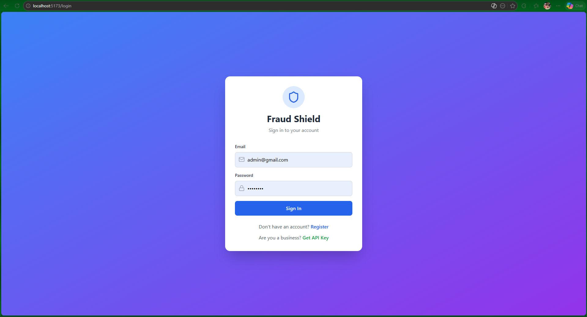
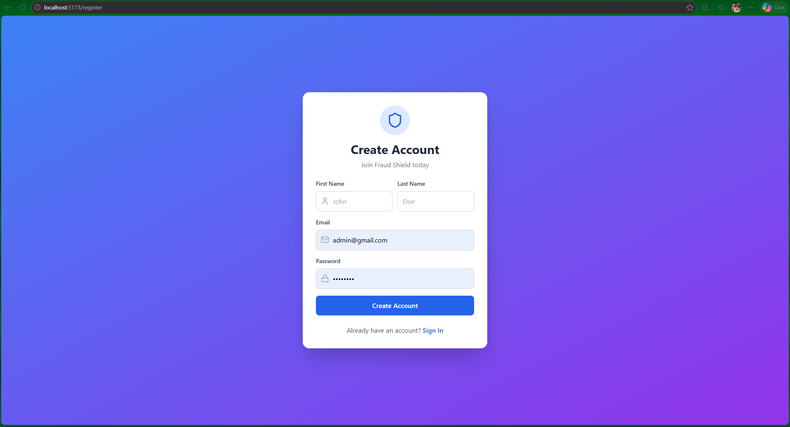
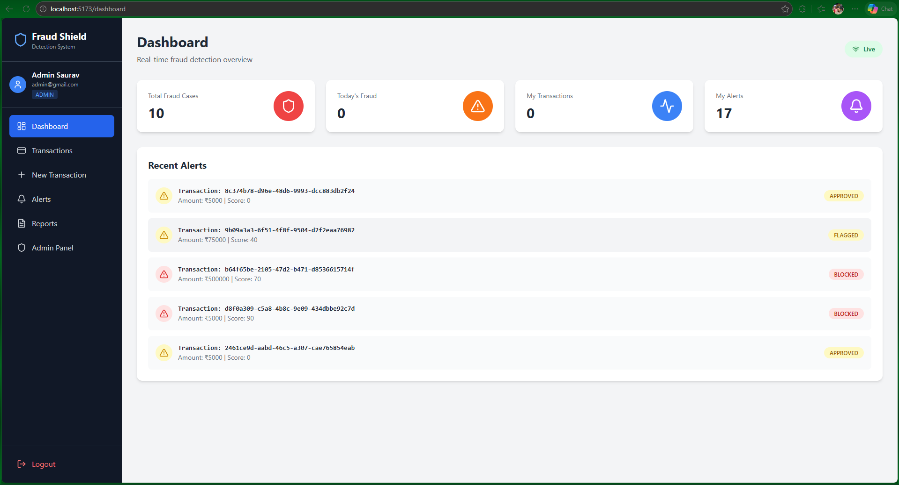
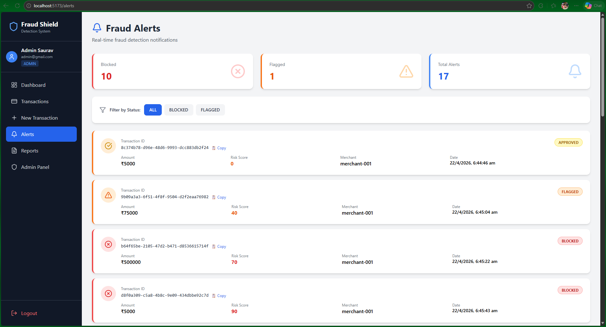
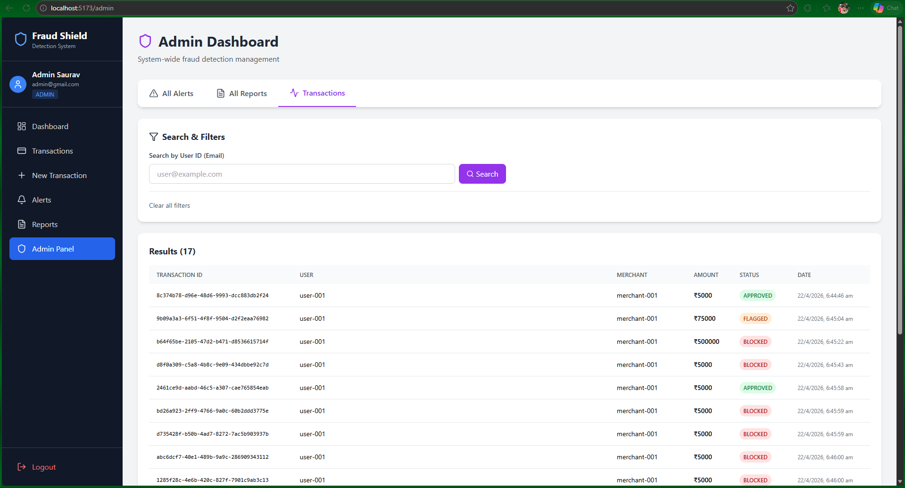
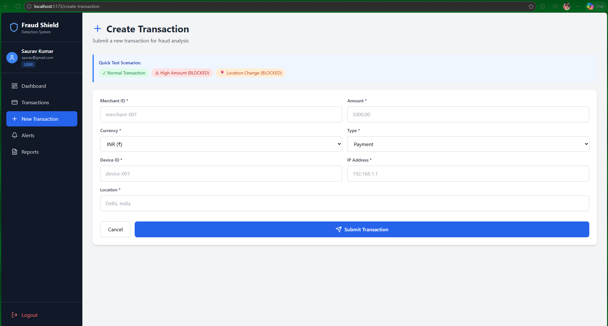
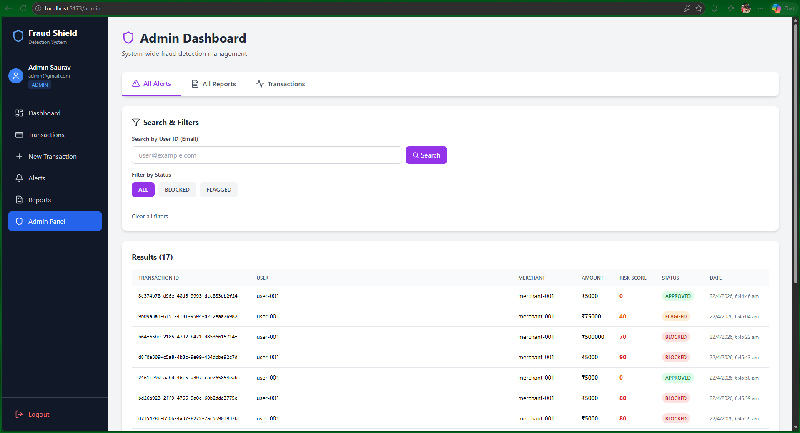
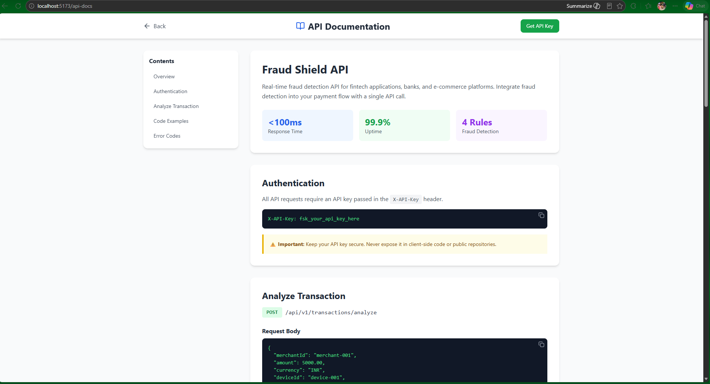

# 🛡️ Fraud Shield - Real-Time Fraud Detection System

[](https://www.java.com)
[](https://spring.io/projects/spring-boot)
[](https://reactjs.org)
[](https://www.docker.com)
[](LICENSE)

A production-grade real-time fraud detection system built with Spring Boot microservices, Kafka, and React. Designed for fintech applications requiring instant fraud detection at scale.

## 🎯 Project Highlights

- ⚡ **Real-time fraud detection** with sub-100ms response time
- 🏗️ **8 microservices** with event-driven architecture
- 🔐 **Dual authentication** - JWT for web/mobile + API Key for B2B
- 📊 **Tiered rate limiting** - burst + sustained protection per role
- 🎨 **Beautiful React dashboard** with real-time WebSocket alerts
- 🧪 **62 unit tests** with JaCoCo coverage
- 📈 **Load tested** with JMeter (60% block rate on flash attacks)
- 🚀 **Production-ready** observability with Prometheus, Grafana, Loki, Tempo

## 📸 Screenshots

### 🔐 Authentication
<table>
  <tr>
    <td></td>
    <td></td>
  </tr>
  <tr>
    <td align="center"><b>Login Page</b></td>
    <td align="center"><b>Register Page</b></td>
  </tr>
</table>

### 📊 User Dashboard

*Real-time dashboard with live indicator and stats*


*Live fraud alert appearing via WebSocket*

### 💳 Transactions
<table>
  <tr>
    <td></td>
    <td></td>
  </tr>
  <tr>
    <td align="center"><b>Transactions List with Filters</b></td>
    <td align="center"><b>Transaction Detail Modal</b></td>
  </tr>
</table>


*Create transaction with quick test scenarios*

### 🚨 Alerts & Reports
<table>
  <tr>
    <td></td>
    <td></td>
  </tr>
  <tr>
    <td align="center"><b>Alerts Page</b></td>
    <td align="center"><b>Reports with Charts</b></td>
  </tr>
</table>

### 👨‍💼 Admin Panel

*System-wide view with user/merchant search and filters*

### 🏢 Merchant Portal (B2B)
<table>
  <tr>
    <td></td>
    <td></td>
  </tr>
  <tr>
    <td align="center"><b>Merchant Registration</b></td>
    <td align="center"><b>API Key Generated</b></td>
  </tr>
</table>


*Complete API documentation with code examples*

### 🔍 Infrastructure & Monitoring
<table>
  <tr>
    <td></td>
    <td></td>
  </tr>
  <tr>
    <td align="center"><b>Eureka Service Discovery</b></td>
    <td align="center"><b>Grafana Monitoring</b></td>
  </tr>
</table>

## 🏗️ Architecture

┌─────────────────────────────────────────────────────────────┐
│                    React Dashboard (5173)                    │
└──────────────────────────┬──────────────────────────────────┘
│
┌──────────────────────────▼──────────────────────────────────┐
│                  API Gateway (8080)                          │
│  • JWT Auth  • API Key Auth  • Rate Limiter  • CORS         │
└──────────────────────────┬──────────────────────────────────┘
│
┌──────────┬───────┼───────┬───────────┐
│          │       │       │           │
┌───────▼──┐ ┌────▼───┐ ┌─▼────┐ ┌▼──────┐ ┌──▼─────┐
│ User     │ │Transac-│ │Fraud │ │Alert  │ │Report  │
│ Service  │ │tion    │ │Detect│ │Service│ │Service │
│ (8084)   │ │(8081)  │ │(8082)│ │(8083) │ │(8085)  │
└──────────┘ └────────┘ └──────┘ └───────┘ └────────┘
│          │       │       │           │
└──────────┴───┬───┴───────┴───────────┘
│
┌─────────────▼──────────────┐
│   Eureka, Config Server    │
│   Kafka, Redis, Databases  │
└────────────────────────────┘

## 🛠️ Tech Stack

### Backend
- **Java 21** with Spring Boot 3.5.11
- **Spring Cloud 2025.0.1** (Eureka, Gateway, Config, Bus)
- **Apache Kafka** for event streaming
- **Redis** for caching and rate limiting state
- **PostgreSQL** for relational data
- **MongoDB** for fraud patterns
- **Spring Security + JWT** authentication
- **Bucket4j** for tiered rate limiting

### Frontend
- **React 18** with Vite
- **React Router v6** for navigation
- **Tailwind CSS** for styling
- **Recharts** for data visualization
- **SockJS + STOMP** for WebSocket
- **Axios** for API calls
- **React Hot Toast** for notifications

### DevOps
- **Docker Compose** for local development
- **Prometheus** for metrics
- **Grafana** for dashboards
- **Loki + Alloy** for logging
- **Tempo** for distributed tracing
- **JMeter** for load testing
- **JUnit 5 + Mockito + JaCoCo** for testing

## 🚀 Quick Start

### Prerequisites
- Java 21
- Maven 3.8+
- Docker Desktop
- Node.js 18+
- PostgreSQL client (optional)

### 1. Start Infrastructure
```bash
docker-compose up -d
```

### 2. Start Services (in order)
```bash
# Start each service in IntelliJ or terminal:
1. eureka-server (8761)
2. config-server (8888)
3. user-service (8084)
4. transaction-service (8081)
5. fraud-detection-service (8082)
6. alert-service (8083)
7. report-service (8085)
8. api-gateway (8080)
```

### 3. Start React Dashboard
```bash
cd fraud-shield-dashboard
npm install
npm run dev
```

Open `http://localhost:5173` ✨

## 📊 Service Documentation

- [API Gateway](docs/services/api-gateway.md)
- [Transaction Service](docs/services/transaction-service.md)
- [Fraud Detection Service](docs/services/fraud-detection-service.md)
- [Alert Service](docs/services/alert-service.md)
- [User Service](docs/services/user-service.md)
- [Report Service](docs/services/report-service.md)
- [Eureka Server](docs/services/eureka-server.md)
- [Config Server](docs/services/config-server.md)

## 🎨 Fraud Detection Rules

| Rule | Priority | Score | Detection |
|------|----------|-------|-----------|
| **Blacklist** | 1 | 100 | User/Merchant/IP in blacklist |
| **Velocity** | 2 | 80 | >5 transactions in 10 minutes |
| **Amount** | 3 | 70/40 | High amount thresholds |
| **Location** | 4 | 90 | Location change detected |

**Verdict Logic:**
- Score ≥ 70 → **BLOCKED** 🚫
- Score ≥ 40 → **FLAGGED** ⚠️
- Score < 40 → **APPROVED** ✅

## 🔐 Security Features

### Authentication
- **Web/Mobile**: JWT tokens (HMAC-SHA384)
- **B2B**: API Key authentication
- **Centralized validation** at API Gateway only

### Rate Limiting
- **Tiered protection**: burst + sustained limits
- **Per-role limits**:
    - USER: 10/sec, 100/min
    - MERCHANT: 20/sec, 1000/min
    - ANALYST: 15/sec, 500/min
    - ADMIN: 50/sec, 10000/min

### Best Practices
- BCrypt password hashing
- Environment-based secrets
- CORS configuration
- Stateless sessions

## 🧪 Testing

### Unit Tests
```bash
mvn clean test
```

**Coverage:**
- 62 unit tests across 5 services
- Rules Engine: 97% coverage
- Fraud Rules: 95% coverage
- Overall: 71% coverage

### Load Testing
```bash
# Generate JMeter HTML report
jmeter -g load-tests/results.jtl -o load-tests/html-report/
```

**Results:**
- 150 concurrent requests
- 60% block rate (rate limiter working)
- Sub-100ms average response time

## 🌐 API Reference

### Public Endpoints
```http
POST /api/auth/register      # User registration
POST /api/auth/login         # User login
POST /api/merchant/register  # Merchant onboarding (get API key)
```

### Authenticated Endpoints (JWT)
```http
POST /api/transactions
GET  /api/transactions/my-transactions
GET  /api/alerts/my-alerts
GET  /api/reports/my-reports
GET  /api/reports/stats/total-fraud
GET  /api/reports/stats/today-fraud
```

### B2B Endpoints (API Key)
```http
POST /api/v1/transactions/analyze
```

### Admin Endpoints (ADMIN/ANALYST role)
```http
GET /api/transactions/user/{userId}
GET /api/alerts/user/{userId}
GET /api/alerts/status/{status}
GET /api/reports/merchant/{merchantId}
```

## 📈 Observability

- **Eureka**: http://localhost:8761
- **Grafana**: http://localhost:3000 (admin/admin)
- **Prometheus**: http://localhost:9090
- **Loki Logs**: Via Grafana datasource
- **Tempo Traces**: Via Grafana datasource

## 🎓 Design Patterns Used

- **Microservices Architecture**
- **Chain of Responsibility** (Rules Engine)
- **Strategy Pattern** (Fraud Rules)
- **SAGA Pattern** (Choreography via Kafka)
- **API Gateway Pattern**
- **Circuit Breaker** (Future enhancement)
- **CQRS** (Read/Write separation)

## 📝 SOLID Principles

- **S**: Each microservice has single responsibility
- **O**: Rules Engine open for new rules, closed for modification
- **L**: All FraudRule implementations substitutable
- **I**: Focused interfaces (FraudRule with 3 methods)
- **D**: Constructor injection, depend on abstractions

## 🔄 Event Flow
```
1. POST /api/transactions (with JWT)
2. API Gateway validates JWT
3. Transaction saved to PostgreSQL
4. TransactionEvent → Kafka [transaction-events]
5. Fraud Detection runs Rules Engine
6. FraudAlertEvent → Kafka [fraud-alerts]
7. Alert Service → WebSocket + Email
8. Report Service → PostgreSQL + MongoDB
```

---

## ⚙️ Dynamic Config Refresh
```bash
# Change any config in configs/ folder
# Then hit:
POST http://localhost:8888/actuator/busrefresh

# All services refresh automatically!
# Zero restarts needed ✅
```

---

## 📊 Monitoring
```
Grafana:    http://localhost:3000
Prometheus: http://localhost:9090
Eureka:     http://localhost:8761
```

---

## 📚 Documentation

| Document | Description |
|---------|-------------|
| [HLD](docs/architecture/HLD.md) | High level design |
| [LLD](docs/architecture/LLD.md) | Low level design |
| [Why Microservices](docs/architecture/decisions/why-microservices.md) | Architecture decision |
| [Why Kafka](docs/architecture/decisions/why-kafka.md) | Kafka choice |
| [Why Redis](docs/architecture/decisions/why-redis.md) | Redis choice |
| [Rules Engine](docs/design-patterns/rules-engine.md) | Design pattern |
| [SAGA Pattern](docs/design-patterns/saga-pattern.md) | SAGA implementation |
| [System Design Q&A](docs/interview-prep/system-design-qa.md) | Interview prep |
| [Kafka Questions](docs/interview-prep/kafka-questions.md) | Kafka interview |
| [Spring Boot Questions](docs/interview-prep/spring-boot-questions.md) | Spring interview |

---

## 🤝 Contributing

This is a portfolio project. Suggestions and feedback welcome!

## 📄 License

MIT License - feel free to use for learning purposes.

## 👨‍💻 Author

**Saurav Kumar**
- LinkedIn: [Saurav Kumar](https://www.linkedin.com/in/saurav-kumar-java-developer)
- GitHub: [@saurav-kumarr](https://github.com/saurav-kumarr)
- Email: csaurav2014@example.com

## 🙏 Acknowledgments

Built as a portfolio project to demonstrate production-grade microservices architecture for fintech applications. Inspired by Razorpay, CRED, and PhonePe fraud detection systems.

---

⭐ If you find this project useful, please consider giving it a star!